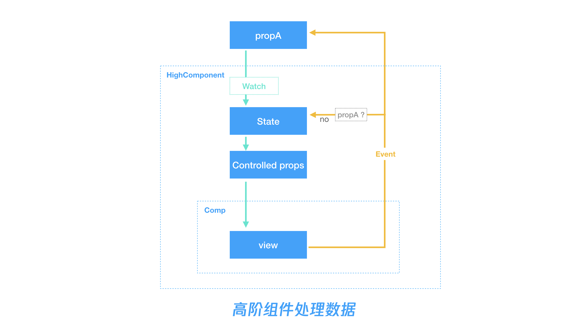

## 高阶组件 map-props 使用说明

属性值应该是受控的，如果用户提供了某个属性，那组件状态应该永远与该属性值对应。

但是某些组件也需要非受控的用法：假如不提供该 prop，组件也要能正常交互并且正确触发变化事件，其中需要实现非受控用法的组件有 input select checkbox radio switch 等。他们都要实现一个 defaultXX 的属性。

使用 map-props 可以使用完全受控的形式开发组件，自动实现非受控的用法。

### 用法

比如，switch 组件的 checked 属性就有非受控用法的需求，需要支持 defaultChecked 属性。
```js
export default mapProp(
  [
    'checked'
  ],
  {
    model: {
      prop: 'checked',
      event: 'change'
    }
  }
)(Switch);
```
mapProps 生成的高阶组件管理受控于非受控逻辑，会有一个对应的 checked 属性以及默认值 defaultChecked 属性。

#### 受控用法的实现

受控时，高阶组件就是简单把接受到的属性传递给源组件，监听源组件的事件再 emit 出去。

**属性**

高阶组件维护一个 dataChecked 的 data 用来传给 switch，它会监听 checked，更新 dataChecked 最后作为 switch 的 checked 属性，这就实现了受控逻辑，props 更新，对应到原组件的 props 也更新。

**事件**

高阶组件会监听 switch checked 属性更新对应的 event，并且将改事件传递出去，用户监听到这个事件改变传给高阶组件的 checked 属性，从而实现受控属性的更新

#### 非受控用法的实现
重点是非受控的实现，非受控是通过高阶组件内部状态管理的。

依然是 switch 组件为例，当用户没有传 checked 这个属性时，高阶组件会监听源组件的更新 event，判断到用户没有传递 checked 这个受控属性，它会直接更新 dataChecked，然后 dataChecked 作为 checked 属性传入给源组件，实现的效果就是用户即便没有传 checked 属性，switch 也能正常工作，并且用户能监听到 checked 改变的事件，这就是不受控的用法

#### 默认值
mapProps 生成的高阶组件还会默认处理 defaultChecked 属性。用来实现默认值的用法，用户希望以不受控的形式使用组件，但是希望设置一个默认值，mapProps 也会监听该属性，将它传递给 switch 的 checked 属性，从而实现默认值得用法。

#### mapProps 逻辑实现


### Api

工具函数路径：utils/map-props.ts

```js
mapProps(props, options)(Component);
```

#### props
需要映射的 prop 数组，每个 prop 可以是字符串属性名，也可以传递一个对象以实现更多的功能

```jsx
{
  /**
   * 需要映射的属性名，高阶组件会自动生成对应的 default-x 属性 
   */
  name: 'value',

  /**
   * 事件名，告诉高阶组件应该监听什么源组件的什么事件接受数据的变化
   * 
   * 如果该属性是 v-model，则该值默认是 v-model 对应的事件名，不显式指定 event 的话，是 input
   * 
   * 如果该属性不是 v-model，不显式指定 event 的话那默认监听的是 update:属性名 事件，支持 .sync 修饰符
   * 
   * 如果希望 mapProps 帮忙兼容一些旧事件接口，可以提供一个数组，源组件只需要实现数组
   * 第一个事件即可，剩余事件 mapProps 会一一触发
   */
  event: 'change',
  event: ['change', 'discardedChange'],

  /**
   * 别名，如果希望 mapProps 帮忙兼容该属性的旧名接口，可以使用 alias 指定旧接口名，
   * 源组件只需实现最新属性即可
   */
  alias: ['discardedValue']
}
```

#### options

在 options 这里可以指定 v-model 对应的属性和 event

```jsx
{
  model: {
    prop: 'checked',
    event: 'change'
  }
}
```
